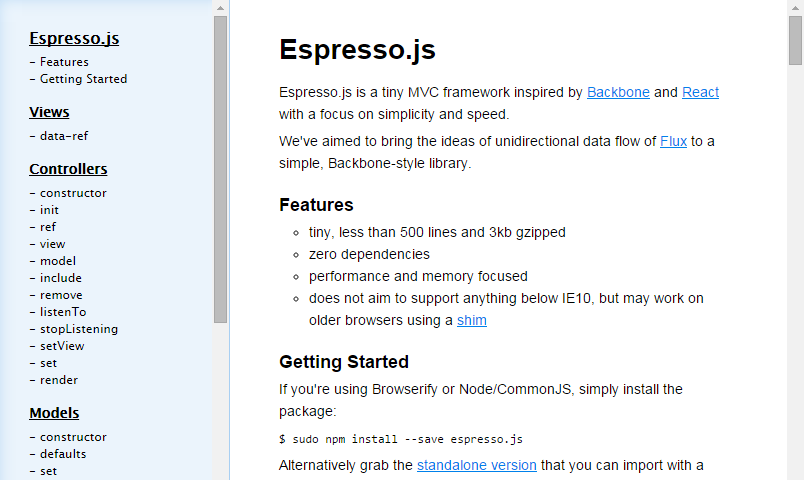

# onedoc

Doc within one page

> Fork of the "backbone style" doc of espresso.js

## Demo

Click: <http://fritx.github.io/onedoc/demo>



## Usage

```js
var onedoc = require('onedoc').render
var html = onedoc('doc.md')
```
